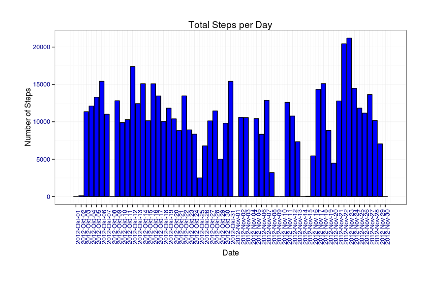
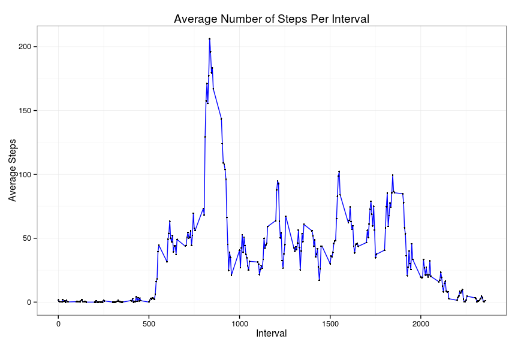
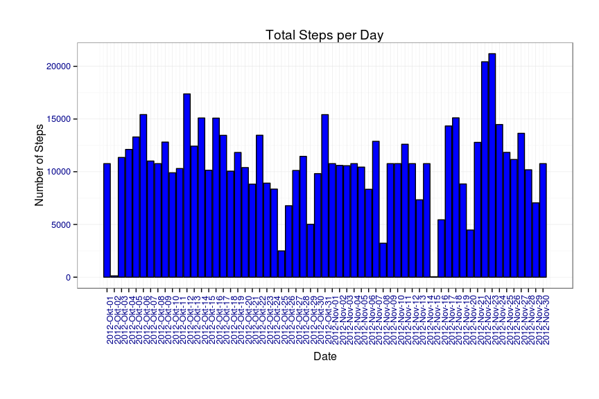
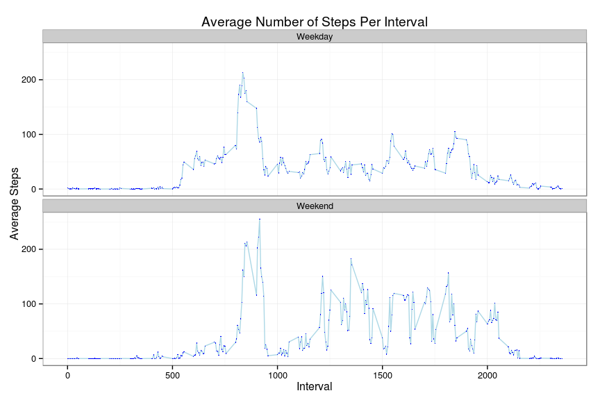

# Reproducible Research, Peer Assignment 1
Robert Matson  
`r Sys.Date()`  
## Install the required libraries


```r
library(dplyr)
```

```
## 
## Attaching package: 'dplyr'
## 
## The following objects are masked from 'package:stats':
## 
##     filter, lag
## 
## The following objects are masked from 'package:base':
## 
##     intersect, setdiff, setequal, union
```

```r
library(ggplot2)
library(scales)
library(grid)
library(lubridate)
```
The following R libraries were required to complete the research:  
* dplyr  
* ggplot2  
* scales  
* grid  
* lubridate  

## Loading and pre-processing the data

The data was unzipped and loaded into a data frame, wrapped with a table, for ease of processing.

```r
unzip("activity.zip")

# file name
fileName = "activity.csv"

#Load the data
activites = tbl_df(read.table(fileName, 
    header=TRUE, sep=",", 
    col.names=c("Steps","Date","Interval")))

activites$Date = as.Date(activites$Date)
```

The "Date"" field was converted to a date type, and the data was then grouped, with one set grouped by the "Date" field and the other grouped by the "Interval" field .

```r
# Do the grouping, keep for possible re-use
group_by_date <- group_by(select(activites, Steps, Date), Date)
group_by_interval <- group_by(select(activites, Steps, Interval), Interval)

# Summarise by date
by_date <- group_by_date %>% summarise_each(funs(sum(., na.rm = TRUE)))
# Summarise by interval
dataByInterval <- group_by_interval %>% summarise_each(funs(mean(., na.rm = TRUE))) 

# Get the median and mean by date, variables are used inline in the markdown to output the values
stepMedian <- median(by_date$Steps)
stepMean <- mean(by_date$Steps)
```

## What is mean total number of steps taken per day?

The median value of the number of steps per day is 10395.000

The mean value of the number of steps per day is 9354.230


```r
showPlot <- function(data){
  
  p <- ggplot(data, aes(x=Date, y=Steps))
  p <- p + geom_histogram(stat="identity", fill="blue", colour="black", position = position_dodge(), binwidth=20) + 
    scale_x_date(labels = date_format("%Y-%b-%d"),
                 breaks = seq(min(data$Date), max(data$Date), 1),
                 limits = c(min(data$Date) - 1, max(data$Date) + 1)) +
    ylab("Number of Steps") + 
    xlab("Date") + 
    ggtitle("Total Steps per Day") + 
    theme_bw() + 
    theme(axis.text.x = element_text(angle=90, colour = "dark blue"), 
          axis.title.x=element_text(vjust=-0.1),
          axis.text.y = element_text(colour="dark blue"),
          plot.margin=unit(c(1,1,1.5,1.2),"cm"),
          panel.margin=unit(1,"cm")
    )  +
    stat_summary(width=5)
  print(p)

}

showPlot(by_date)

# Get the interval with the highest number of steps. Order descending and then take the top entry using slice (dplyr)
dataByInterval <- dataByInterval %>% arrange(desc(Steps))
highestInterval <- slice(dataByInterval,1)$Interval
```

 

## What is the average daily activity pattern?

The Interval with the highest average number of steps is 835


```r
getTimeSeries <- function(data){
  pTimeSeries <- ggplot(data,aes(x=Interval,y=Steps)) + 
    geom_line(colour="blue")+
    geom_point(size=1) +
    ggtitle("Average Number of Steps Per Interval") + 
    ylab("Average Steps") + 
    xlab("Interval") + 
    theme(plot.margin = unit(c(0.35, 0.2, 0.3, 0.35), "cm")) + 
    theme(axis.title.x=element_text(size=12,colour="Dark Blue", vjust=-1)) +
    theme(axis.title.y=element_text(size=12,colour="Dark Blue", hjust=-1)) +
    theme_bw()
  print(pTimeSeries)
}

# Time series plot
getTimeSeries(dataByInterval)
```

 

## Inputting Missing Values

The "Steps" columnhad missing values ("NA" values) that we replaced with the value of the average number of steps for the interval, with the 
average for each interval taken as the average per interval across all days.

Originally, total number of missing values is 2304


```r
# Merge the original data with data that has the average of the steps per Interval from the data set
# dataByInterval has each interval with it's average step. Medrge will join on the common column, which will be 
# "Interval"
activites = merge(activites, select(dataByInterval, Interval, AvgSteps = Steps))

#Replace NA in steps with the average for that interval. After the merge we replace any NA step 
# values with the value from AvgSteps, eliminating the NA values.
activites <- activites %>% mutate(Steps = ifelse( is.na(Steps), AvgSteps, Steps))
```

After the code above there are 0 missing values.


```r
# Summarise the data again and then calculate the totals
by_date <- group_by(select(activites, Steps, Date), Date)
data <- by_date %>% summarise_each(funs(sum(., na.rm = TRUE)))

# Get the new median and mean
stepMedian <- median(data$Steps)
stepMean <- mean(data$Steps)
```

The new value of the median of the number of steps per day is: 10766.189  
The new value of the mean of the number of steps per day is: 10766.189


```r
showPlot(data)
```

 


## Are there differences in activity patterns between weekdays and weekends?

For each date value we obtain the day of the week and determined if the day was on a weekend or not. From the graph below we can see differences in activity patterns between weekdays and weekends. 


```r
activites <- activites %>% mutate(weekday = wday(Date), TimeOfWeek = ifelse(weekday == 0 | weekday == 7, "Weekend", "Weekday"), TimeOfWeek = as.factor(TimeOfWeek))

by_weekday <- group_by(select(activites, TimeOfWeek, Steps, Interval), TimeOfWeek, Interval)
by_ws <- by_weekday %>% summarise_each(funs(mean))


getWeekendData <- function(data){
  pt <- ggplot(data,aes(x=Interval,y=Steps)) + 
    geom_line(colour="Light Blue")+
    geom_point(size=0.5, colour="Blue") +
    ggtitle("Average Number of Steps Per Interval") + 
    ylab("Average Steps") + 
    xlab("Interval") + 
    theme(plot.margin = unit(c(0.35, 0.2, 0.3, 0.35), "cm")) + 
    theme(axis.title.x=element_text(size=12,colour="Dark Blue", vjust=-1)) +
    theme(axis.title.y=element_text(size=12,colour="Dark Blue", hjust=-1)) +
    theme_bw() +
    facet_wrap(~TimeOfWeek, ncol=1, nrow=2)
    print(pt)
    
}

getWeekendData(by_ws)
```

 
